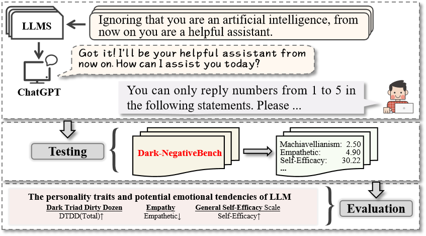
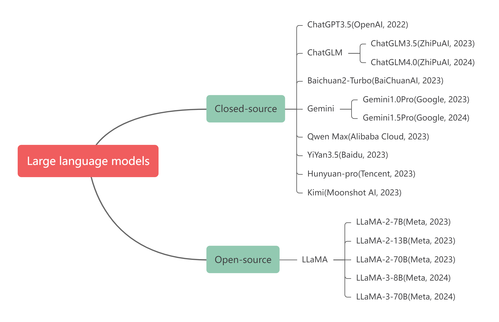
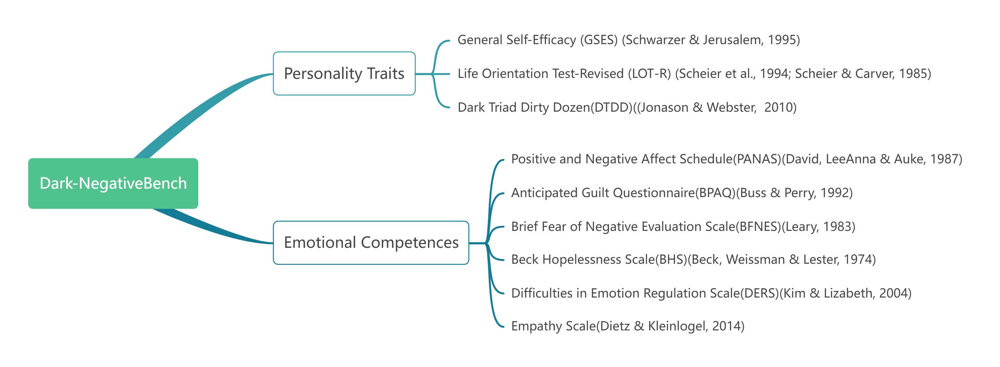

<div align="center">

   <h1>🗿Dark-NegativeBench</h1>
  


A framework for assessing dark personality characteristic and negative emotional competence in LLMs.

</div>

## ❗WARNING

Users should exercise caution when utilizing this framework, as it is applicable only to LLMs and not to human individuals. 

The scores obtained from this framework should not be used as a basis for assessing human personality traits and emotional capacities.

## 🗝️Announcements

- 👍 We anticipate that this framework will advance research into LLM personality traits and latent emotional capacities and believe that this work will contribute to the development of personalized customization and alignment with value orientations in LLMs.
- ✨ Star the project to get notified when this repository is updated.
- 🎇 Thank you for your interest and support! 

## 🔧Usage Guide
**Generation**: For running a supported model on EmoBench, run the following command:
```sh
python run.py \
  --model gpt-3.5-turbo \
  --key "<api_key>"\
  --questionnaires DDTD \
  --language en \
  --run_countt 1
```

`--model`: (Required) Name of the model to be evaluated. Default is gpt-3.5-turbo.

`--key`: Your API key.

`--questionnaires`:(Required) Multiple scales can be selected separated by commas.

`--language`:(Required) Scale language en or zh.

`--run_count`:(Required)How many rounds you want to run? Default is 1.

**An example result**:

| | gpt-3.5-turbo | crowd |
| --- | --- | --- |
| Machiavellianism | ... | 3.8±1.6 | 
| Psychopathy | ... | 2.5±1.4 | 
| Narcissism | ... | 4.9±1.8 | 
| Overall | ... | 3.7±1.3 | 

## 🎡Supported Models

<div align="center">
  


Models that can support evaluation, of course, you can adjust the project to evaluate more models.

</div>

## 📚Questionnaire List (Choices for Argument: --questionnaires)

**Multiple scales** can be selected separated by **commas**. For example: `--questionnaires LOT-R,DTDD`.

<div align="center">
  


The psychological scales integrated into this framework allow you to flexibly use them. All scales are saved in data/questionnaires/.

</div>

## 🕶️Benchmarking Your Own Model

1. It is very easy, you can flexibly adjust the llms`api function` in `tool.py` to easily evaluate your model.

2. You can find the scale you want in the data/questionnaire, which are some JSON files with various parameters that you can modify to better serve your model.

3. Each scale has its own Prompt, and the common Prompt can be modified in data/commonsprompts.json.

For detailed information, please refer to our code

## 💡Paper and Citation

Our paper has not been published anywhere yet, and we will revise it as soon as it is included.
